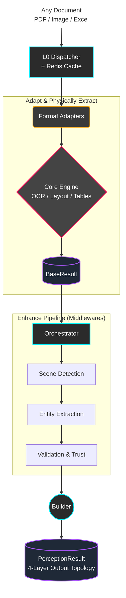

<p align="center">
  <h1 align="center">📄 DocMirror</h1>
  <p align="center">
    <em>Universal Industrial-Grade Document Parsing Engine</em><br/>
    Extract highly-structured data from any document format with military-grade precision.
  </p>
  <p align="center">
    <a href="https://pypi.org/project/docmirror/"></a>
    <a href="https://pypi.org/project/docmirror/"></a>
    <a href="LICENSE"></a>
    <a href="https://github.com/valuemapglobal/docmirror/actions"></a>

  </p>
</p>

---

**DocMirror** is a cutting-edge Python library built for the toughest document parsing environments. Go beyond simple text extraction. DocMirror combines computer vision, topological layout algorithms, and middleware intelligence to deliver pure, structured data and verifiable trust scores from messy, real-world documents.

## ⚡ The Killer Features

| Capability | What makes it different? |
| :--- | :--- |
| **🛡️ Anti-Forgery & Tamper Detection** | Integrates Pixel Error Level Analysis (ELA) and Metadata Blacklisting. It doesn't just read documents; it tells you if the document was Photoshopped. |
| **🧠 Topological Divide-and-Conquer Layout** | Drops naive heuristics and uses spatial clustering (DBSCAN + X-Y Cuts) guided by DocLayout-YOLO to accurately reconstruct reading orders even on dense, multi-column financial reports. |
| **🏦 Bank-Grade CCB Table Repair** | Native algorithmic immunity against complex table structure anomalies (e.g., China Construction Bank staggered grids) doing what LLMs and basic vision models notoriously fail at. |
| **👁️ Dynamic Multi-Scale OCR** | RapidOCR core supercharged with dynamic color-slicing and contrast boosting to rescue faded, low-DPI scans. |
| **🧩 Zero-Friction Plugin Architecture** | Write custom Domain Plugins (`BankStatement`, `Invoice`) that magically bind unstructured output to your exact Pydantic entity schemas. |

## 🚀 Quick Start

### 1. Install (One-Liner)
```bash
# Get the engine, PDF vision drivers, and high-performance layout analyzers
pip install "docmirror[all]"
```

### 2. Awaken the Engine
Just point `perceive_document` at an image, PDF, Word doc, or Excel sheet. The **L0 Dispatcher** automatically infers the format, spins up the correct Adapter, parses the data, applies your middlewares, and returns a unified 4-layer topology.

```python
import asyncio
from docmirror import perceive_document

async def main():
    # One line to process ANY tricky document
    result = await perceive_document("suspicious_bank_statement.pdf")

    print(f"Status: {result.status} | Scene: {result.scene}")
    
    # Check if the document was forged
    if result.provenance.validation.is_forged:
        print(f"⚠️ FORGERY DETECTED: {result.provenance.validation.forgery_reasons}")
    
    # Zero in on extracted entities directly mapped from your plugins
    print(f"Entities: {result.content.entities}")

asyncio.run(main())
```

> **Pro-Tip**: Prefer the CLI? `python3 -m docmirror document.pdf --format json`

## 🏗️ The 4-Layer Architecture

DocMirror abandons monolithic parser designs in favor of a strict, highly observable pipeline. From the raw bytes reading to the final Python properties, every step is rigorously logged and structurally sound.



### The Output: `PerceptionResult`
DocMirror guarantees a standardized payload structure regardless of where the data came from.
- **Envelope/Status**: `success`, `confidence`, `timing`
- **Content**: Plain markdown `text`, localized geometric `blocks` (Tables, Paragraphs, Images), and `entities`.
- **Identity**: Domain-resolved logic via Aho-Corasick dictionary matching.
- **Trust**: `validation_scores`, `is_forged`, and subsystem execution times.

## 🤝 Community & Support

- **Documentation**: [Complete API & Guide](https://valuemapglobal.github.io/docmirror/)
- **Bug tracker**: [GitHub Issues](https://github.com/valuemapglobal/docmirror/issues)
- **Contribution**: We welcome Pull Requests! Make sure to `make test` (129+ E2E validations) before submitting.

## 📄 License & Authors

Created by **Adam Lin** and proudly maintained by **ValueMap Global**.  
Released under the [Apache 2.0 License](LICENSE).
