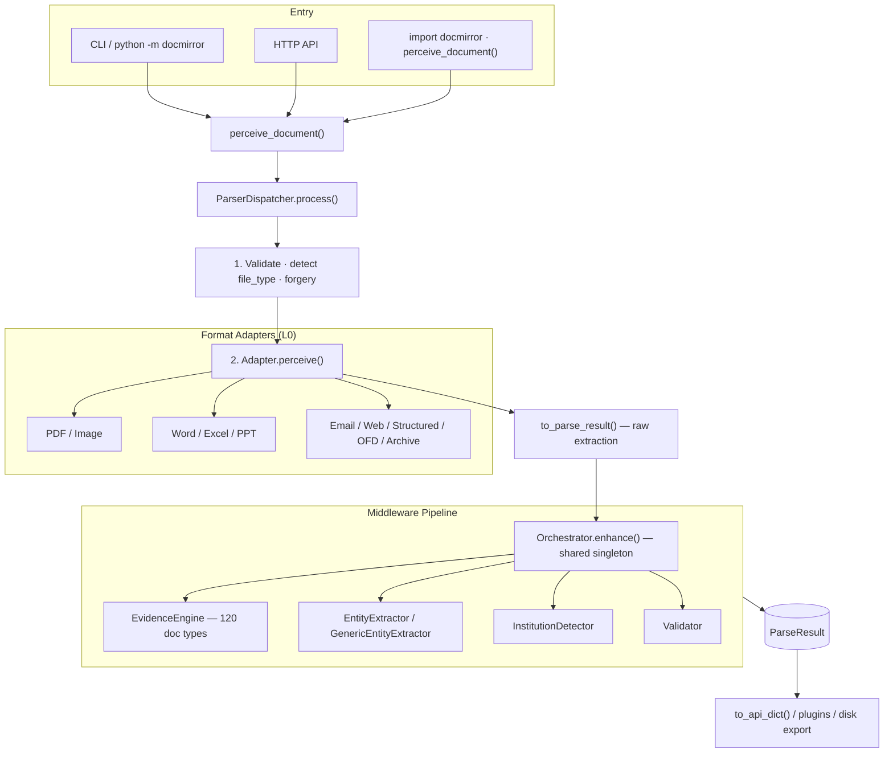

# Architecture

## System Overview

DocMirror turns a file path into a structured **`ParseResult`**. The pipeline has three major phases: **L0 routing & extraction**, **middleware enhancement**, and **optional domain plugins / API export**.



## Entry Points

Three ways to start DocMirror; all converge on **`perceive_document()`**:

| Entry | Module | Notes |
|-------|--------|-------|
| CLI | `docmirror/__main__.py`, `docmirror/cli/main.py` | `docmirror parse file.pdf` |
| HTTP | `docmirror/server/api.py` | `uvicorn docmirror.server.api:app` |
| Python library | `docmirror/core/factory.py` | `from docmirror import perceive_document` |

`perceive_document()` is the **only public parsing API**. It returns a **`PerceiveResult`** envelope: ``.mirror`` is the frozen Mirror ``ParseResult``; optional ``.editions`` holds PEC outputs when ``PerceiveOptions(editions=[...])`` is set. Attribute access (``result.full_text``, etc.) delegates to ``mirror`` for backward compatibility.

## Service Container & Singletons

Framework services are managed by **`docmirror/di/container.py`** (lazy, thread-safe singletons):

| Service | Accessor | Role |
|---------|----------|------|
| Settings | `get_settings()` | Env-backed `DocMirrorSettings` |
| Dispatcher | `get_dispatcher()` | L0 routing — **single instance per process** |
| Orchestrator | `get_orchestrator()` | Middleware pipeline — **single instance per process** |

`PerceptionFactory.get_dispatcher()` in `core/factory.py` **delegates** to `get_dispatcher()` — there is no second dispatcher singleton.

`BaseParser.perceive()` uses `get_orchestrator()` for middleware enrichment (not a per-call `Orchestrator()`).

Tests reset all singletons via `reset_container()` or `PerceptionFactory.reset()`.

## Layer Architecture

| Layer | Module | Responsibility |
|-------|--------|----------------|
| **API** | `core/factory.py` | `perceive_document()`, `PerceiveOptions` |
| **Dispatch** | `framework/dispatcher.py` | Validate file, detect type, route to adapter |
| **Adapt** | `adapters/*` | Format-specific extraction → `ParseResult` |
| **Enhance** | `framework/orchestrator.py` + `middlewares/*` | Classification, entities, validation |
| **Extract (internal)** | `core/pipeline`, `core/extraction`, `core/table`, `core/ocr` | CPS stages inside PDF/Image adapters |
| **Classify (scene)** | `core/scene/evidence_engine.py` | 120 business document types (MEP middleware) |
| **Plugins** | `plugins/*` | Domain-specific structured output |
| **Output** | `models/entities/parse_result.py` | Unified `ParseResult` contract (MOC) |

## Models Layer — MOC / DEC / DTI

See **`docs/design/09_models_layer_first_principles_redesign.md`** for the full contract spec.

| Contract | Type | Boundary |
|----------|------|----------|
| **MOC** (Mirror Object Contract) | `ParseResult` | Frozen after `Orchestrator.enhance()` → `001_mirror.json` |
| **DEC** (Domain Extraction Contract) | `DomainExtractionResult` | Plugin output → edition JSON |
| **DTI** (Document Type Identity) | transport / content_model / business_scene | FCR + MEP + `scene_keywords.yaml` |

**Bridge rule**: `ParseResultBridge.from_base_result()` is allowed **only** at the CoreExtractor boundary (Path B). Middleware and plugins must not round-trip through `BaseResult`.

### L0 — ParserDispatcher (FCR-driven)

Three sequential stages (no cache on the default path):

```
process(path)
  ├─ 1. _validate()              → FileContext (transport, content_model, mime, …)
  ├─ 2. resolve_capability()     → format_capabilities.yaml
  ├─ 3. run_extraction_chain()   → TranscodingGate → Adapter → optional fallback
  └─     timing + logging
```

**Format Capability Registry (FCR)** — `configs/yaml/format_capabilities.yaml` — is the single source of truth for extension/MIME → **transport** + **content model** + adapter binding.

| Layer | Key | Example |
|-------|-----|---------|
| Transport | How the file is opened | `pdf`, `image`, `excel`, `archive` |
| Content model | How middleware interprets structure | `fixed_layout_rasterizable`, `tabular_native`, `container` |

**Images**: primary path is `PDFAdapter` → `CoreExtractor` (table fidelity); `ImageAdapter` OCR is fallback when primary is empty.

Legacy Office (`.doc`, `.xls`, `.ppt`) and `.xps` / `.rtf` / `.mhtml` go through **`adapters/transcode/gate.py`** (LibreOffice or internal) before the canonical adapter.

Unsupported formats (e.g. `.wps`) return `UNSUPPORTED_FORMAT` — no silent empty results.

### Adapters — BaseParser contract

Every adapter subclasses **`framework/base.py` → `BaseParser`**:

1. **`to_parse_result()`** — format-specific extraction (subclass implements).
2. **`perceive()`** — calls `to_parse_result()`, fills provenance if missing, then `Orchestrator.enhance()`.

Archive adapter decompresses zip/rar, runs `perceive()` on each child file, merges pages.

### Orchestrator — Middleware pipeline

**`framework/orchestrator.py`** receives a raw `ParseResult` and runs middleware **in-place**.

Enhancement modes:

| Mode | Behavior |
|------|----------|
| `raw` | Skip all middleware; extraction only |
| `standard` | Default production pipeline (per format) |
| `full` | Extended pipeline where configured (PDF) |

Pipeline **order and membership** are defined in **`configs/yaml/enhancement_profiles.yaml`** (v2 `stages` × **content_model** × enhance_mode).  
**`configs/middleware/resolver.py`** flattens stages, applies guards, and sorts by `depends_on`.  
Middleware **classes** are declared in **`configs/yaml/middleware_catalog.yaml`** (MEP SSOT).

**Mirror boundary:** Orchestrator ends with a frozen `ParseResult` (`001_mirror.json`).  
Community / Enterprise / Finance outputs run **after** middleware via **`plugins/runner.py`** (PEC), then **`server/output_builder.py`** serializes edition JSON.

Example (`standard` / fixed_layout):

```
EntityExtractor → EvidenceEngine → InstitutionDetector → Validator
```

Example (`full` / fixed_layout):

```
LanguageDetector → HeaderInferrer → HeaderAlignment → EntityExtractor → … → AnomalyDetector
```

Classification uses **`EvidenceEngine`** (replaces legacy `SceneDetector`).  
Optional: `DOCMIRROR_ENABLE_SLM=1` appends `SLMEntityExtractor`.

Failure policy: `DOCMIRROR_FAIL_STRATEGY=skip` (default) — failed middleware is logged and skipped; pipeline continues.

## Core Physical Architecture (CPA — design 12)

Core extract follows **CPS (Core Pipeline Stages)**:

```text
entry → DocumentPipeline → analyze → profile → segment → extract/ocr → table (TNP) → bridge → ParseResult
```

| Stage | Directory | Role |
|-------|-----------|------|
| Entry | `core/entry/` | `perceive_document`, `PerceiveOptions`, `PerceiveResult` |
| Pipeline | `core/pipeline/` | `DocumentPipeline`, `PagePipeline`, `PageExtractor`, `PdfSyncProcessor` |
| Table normalize | `core/table/pipeline/` | TNP hooks (`generic`, `ledger_borderless`) |
| OCR (scanned) | `core/ocr/pipeline.py` | UOP facade → `fallback` implementation |
| Scene | `core/scene/` | EvidenceEngine algorithm SSOT |
| Bridge | `core/bridge/` | `ParseResultBridge` (Path B only) |

**CCP (Core Consumer Contract):** plugins may import `table_access` and public entry APIs only.  
Validation: `scripts/audit_core_imports.py`, `tests/contracts/test_ccp_imports.py`, `scripts/validate_core_cps_layout.py`.

Legacy paths removed in **v0.5.0** — use `core/entry/`, `core/segment/`, `core/extract/`, `docmirror/eval/`, `core/scene/` directly.

## ParseResult Model

`ParseResult` is the single output contract (`models/entities/parse_result.py`):

| Zone | Field | Contents |
|------|-------|----------|
| Envelope | `status`, `confidence`, `error` | Success / partial / failure |
| Content | `pages[]` | Texts, tables, key-values per page |
| Entities | `entities` | `document_type`, KV entities, domain fields |
| Meta | `parser_info` | Adapter name, timing, engines used |
| Trust | `trust` | Forgery / validation signals |
| Provenance | `provenance` | File type, size, checksum |

Convenience accessors: `full_text`, `total_tables`, `page_count`.

## Plugin System

Domain plugins add business-specific structured output after core parsing:

```python
from docmirror.plugins import DomainPlugin

class InvoicePlugin(DomainPlugin):
    domain_name = "invoice"
    display_name = "Invoice"
    scene_keywords = ("invoice", "bill", "receipt")
```

Classification is driven by **EvidenceEngine** + plugin registry keywords.  
See [Creating Plugins](../plugins/creating-plugins.md).

## Optional Parse Cache

**Not active on the default pipeline.** Module `framework/cache.py` (Redis via `REDIS_URL`) is retained for future API deployments but is **not** called by `ParserDispatcher`.  
`PerceiveOptions.skip_cache` and CLI `--skip-cache` are kept for API compatibility (no-op).

## Output File Naming

DocMirror uses a two-level identifier system for CLI / server disk export.

### Identifiers

- **`task_id`** — One request/command (`YYYYMMDD_HHMMSS_xxxx` or API `request_id`).
- **`file_id`** — Sequential index within a task (`001`, `002`, …).

### Output Structure

```
{output_dir}/
└── {task_id}/
    ├── {file_id}_mirror.json        # Mirror layer: base parse result
    ├── {file_id}_community.json     # Community: 6 premium + generic fallback
    └── {file_id}_enterprise.json    # [optional] Enterprise plugin data
```

### File Format

| File | Contains |
|------|----------|
| `{file_id}_mirror.json` | Full `ParseResult.to_api_dict()` |
| `{file_id}_community.json` | Community plugin payloads (6 premium + generic) |
| `{file_id}_enterprise.json` | Enterprise plugin payloads |

## Related Design Docs

| Topic | Document |
|-------|----------|
| Table layer (physical + logical) | [05_table_layer_first_principles_redesign.md](../design/05_table_layer_first_principles_redesign.md) |
| Core extraction / EPO | [06_core_extraction_first_principles_redesign.md](../design/06_core_extraction_first_principles_redesign.md) |
| Core module layout / CPA | [12_core_module_architecture_first_principles_redesign.md](../design/12_core_module_architecture_first_principles_redesign.md) |
| L0 adapter / FCR | [07_adapter_dispatcher_first_principles_redesign.md](../design/07_adapter_dispatcher_first_principles_redesign.md) |
| Mirror middleware / MEP + PEC | [08_middleware_layer_first_principles_redesign.md](../design/08_middleware_layer_first_principles_redesign.md) |
| Community vs Enterprise | [community-vs-enterprise-edition.md](../design/community-vs-enterprise-edition.md) |
| Configuration & env vars | [configuration.md](configuration.md) |

## Observability

Component-prefixed log labels:

| Label | Subsystem |
|-------|-----------|
| `[Dispatcher]` | L0 validate, route, adapter dispatch |
| `[Orchestrator]` | Middleware pipeline start/end |
| `[Middleware]` | Per-middleware timing and mutations |
| `[EvidenceEngine]` | Document classification |
| `[DI Container]` | Singleton initialization |
| `[PerceptionFactory]` | `perceive_document()` entry |

## Directory Map (framework/)

```
docmirror/
├── core/factory.py          # perceive_document() — public API
├── di/container.py          # Singleton registry (dispatcher, orchestrator, settings)
├── framework/
│   ├── dispatcher.py        # L0 routing
│   ├── base.py              # BaseParser contract
│   ├── orchestrator.py      # Middleware orchestration
│   └── cache.py             # Optional Redis cache (not on default path)
├── adapters/                # Format adapters
├── middlewares/             # Enhancement pipeline steps
├── configs/pipeline/registry.py  # Per-format middleware lists
└── plugins/                 # Domain plugins
```
