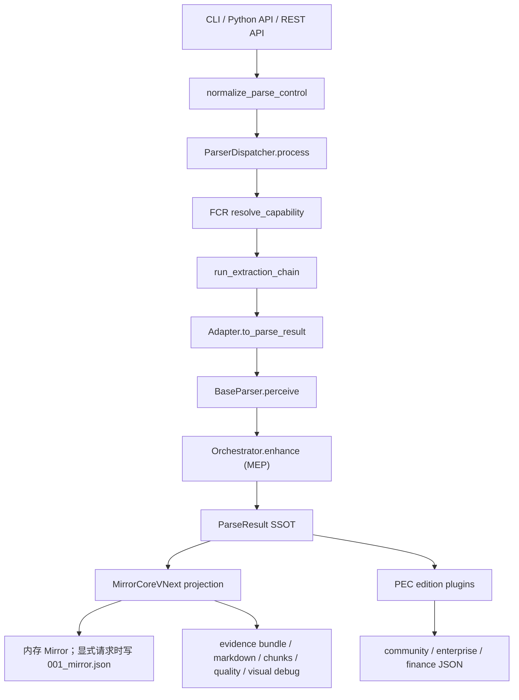

# DocMirror 研发说明手册

版本基线：DocMirror `1.0.0`
适用对象：后续接手 DocMirror 核心研发、插件研发、服务端/API、SDK、测试与发布维护的同事。
编写日期：2026-06-30

## 1. 项目定位

DocMirror 是面向商业凭证的可信解析层，产品定位是 **Commercial Document Trust Layer**。项目目标不是只把文档转成文本、表格或 Markdown，而是输出可追溯、可审计、可进入业务系统的结构化信号。

核心承诺：

- Parse：从 PDF、图片、Office、邮件、网页、结构化文件、压缩包等输入中解析文档内容。
- Prove：为关键字段、结构、事实和表格保留来源、页码、bbox、置信度、诊断和质量信息。
- Trust：通过质量报告、证据包、可视化调试和 `needs_review` 等信号，帮助下游决定自动入库、人工复核或拒绝。

1.0.0 的主要稳定基线包括：

- Python 包版本为 `1.0.0`，公共包名为 `docmirror`。
- Python 支持 `>=3.10`，测试矩阵覆盖 Python 3.10 到 3.13。
- 公共 OSS wheel 只打包 `docmirror` 主包；`docmirror_enterprise`、`docmirror_finance`、`tests`、`scripts`、`docs`、`sdks` 等不进入公共 wheel。
- Canonical 输出是 Mirror JSON vNext，schema 标识为 `docmirror.mirror_json`，当前 schema version 为 `1.0.3`。
- CLI、REST API、Python API 和 edition 输出最终都围绕同一个 `ParseResult`/Mirror 投影链路工作。

## 2. 快速上手

### 2.1 本地开发环境

```bash
python -m venv .venv
source .venv/bin/activate
pip install -e ".[all,dev,docs]"
pre-commit install
```

最小验证：

```bash
docmirror --help
docmirror doctor
pytest tests/smoke/ -q
```

如果只做轻量核心开发，可先装：

```bash
pip install -e ".[dev]"
```

涉及 PDF、OCR、Office、服务端或 AI/VLM 路径时，再按需安装 extras：

```bash
pip install -e ".[pdf,ocr,office,server,ai,dev]"
```

### 2.2 本地运行

运行公开 quickstart：

```bash
python3 examples/trust_quickstart.py
```

解析单个文件：

```bash
docmirror statement.pdf --output-dir ./output
docmirror statement.pdf --profile quickstart
```

启动 API 服务：

```bash
pip install -e ".[server]"
uvicorn docmirror.server.api:app --host 0.0.0.0 --port 8000
```

Docker 服务：

```bash
docker build -t docmirror:latest .
docker run --rm -p 8000:8000 docmirror:latest
```

## 3. 术语速查

| 缩写/术语 | 含义 | 代码位置 |
|---|---|---|
| FCR | Format Capability Registry，格式能力注册表，负责扩展名/MIME 到 adapter 的路由 | `docmirror/configs/yaml/format_capabilities.yaml` |
| MEP | Middleware Execution Platform，Mirror 层中间件增强管线 | `docmirror/configs/yaml/middleware_catalog.yaml`、`enhancement_profiles.yaml` |
| MOC | Mirror Object Contract，所有 adapter 产出的核心 `ParseResult` 合同 | `docmirror/models/entities/parse_result.py` |
| UDTR | vNext Mirror 主线，文档拓扑、页面、证据、阅读流和语义投影 | `docmirror/models/mirror/`、`docmirror/topology/` |
| PEC | Plugin Execution Contract，核心 Mirror 之后的 edition 插件执行合同 | `docmirror/plugins/_runtime/runner.py` |
| DEC | Domain Extraction Contract，领域插件输出的规范化合同 | `docmirror/models/entities/domain_result.py`、`docmirror/models/schemas/` |
| DMIR | DocMirror Intermediate Representation，供 SDK/LLM/RAG 使用的中间表达 | `docmirror/output/dmir.py` |
| TQG | Test Quality Gate，manifest 驱动的质量门平台 | `docmirror/eval/tqg/`、`tests/regression/` |
| four-file output | CLI/API 持久化的多版本 JSON 输出合同 | `docmirror/server/edition_outputs.py` |

## 4. 仓库结构

```text
docmirror/
  input/             输入入口、ParseControl、adapter、格式桥接
  framework/         Dispatcher、Orchestrator、DI、中间件框架
  layout/            布局分析、页面分区、场景证据、机构线索
  topology/          页面拓扑、阅读顺序、区域图、跨页关系
  ocr/               OCR、扫描件恢复、微网格、局部结构修复
  tables/            表格检测、重建、标准化、流水类表格逻辑
  models/            ParseResult、Mirror vNext、实体、schema、edition serializer
  plugins/           社区领域插件和插件运行时
  output/            Mirror/DMIR/Markdown/chunks/CSV/PDFUA 等输出
  evidence/          证据包、source span、visual overlay、diff
  quality/           质量门、质量聚合、review 信号
  configs/           YAML/JSON schema、运行时设置、格式/中间件/领域配置
  runtime/           进度、artifact、checkpoint、scheduler、序列化
  security/          隐私、脱敏、安全检查、egress/resource gate
  server/            FastAPI、MCP、API output builder、artifact pack
  cli/               Click CLI 子命令
  sdk/               Python 客户端集成 helpers
```

周边目录：

```text
docmirror_enterprise/   企业版插件源码，公共 wheel 不打包
docmirror_finance/      金融版插件源码，公共 wheel 不打包
tests/                  单元、契约、回归、集成、e2e 测试
scripts/                质量门、release gate、schema/openapi 生成、架构校验
sdks/                   TypeScript、Go、Java、MCP Server SDK
docs/                   MkDocs 公开文档
examples/               quickstart 和演示脚本
```

## 5. 核心架构

### 5.1 主调用链



### 5.2 三个边界要守住

1. Adapter 边界：adapter 只负责把输入格式转成 `ParseResult`，不要写领域业务逻辑。
2. Mirror 边界：MEP 增强完成后，`ParseResult` 是核心 SSOT；Mirror vNext 是公共 canonical 投影。
3. Edition 边界：community/enterprise/finance 插件在 Mirror 之后运行，不应反向污染核心 Mirror。

这三个边界对应的关键文件：

- `docmirror/framework/base.py`
- `docmirror/framework/dispatcher.py`
- `docmirror/framework/orchestrator.py`
- `docmirror/input/pipeline/__init__.py`
- `docmirror/server/output_builder.py`
- `docmirror/plugins/_runtime/runner.py`

## 6. 输入与解析管线

### 6.1 公共入口

Python API：

```python
from docmirror import perceive_document

result = await perceive_document("statement.pdf")
mirror = result.to_mirror_json_vnext()
```

CLI：

```bash
docmirror document.pdf
docmirror document.pdf --mirror --format markdown,chunks --debug-artifact
```

开源版默认只持久化 `001_community.json`。`--mirror` 是常用的显式 Mirror
开关；高级调用仍可通过 output profile 或 `output.editions` 精确控制产物。

REST：

```bash
curl -F "file=@document.pdf" http://localhost:8000/v1/parse
```

入口关系：

- `docmirror.__init__.py` 提供轻量 lazy import 的 `perceive_document`。
- `docmirror/input/pipeline/__init__.py` 是统一 document entry pipeline。
- `docmirror/cli/main.py` 是 Click CLI 根命令。
- `docmirror/__main__.py` 实现 CLI parse 工作流和输出持久化。
- `docmirror/server/api.py` 暴露 FastAPI 路由。

### 6.2 ParseControl

所有 CLI/API/库调用的用户意图都应汇入 `normalize_parse_control()`，不要在业务代码里重复解析命令参数。

关键字段：

| 字段 | 说明 |
|---|---|
| `pages` | `1-3,8,10-`、`first:N`、`last:N` 等页码范围 |
| `resource.workers` | `auto` 或明确 worker 数；不进入 deterministic fingerprint |
| `mode` | `auto`、`fast`、`balanced`、`accurate`、`forensic` |
| `execution.cache_policy` | `read-write`、`read-only`、`refresh`、`off` |
| `execution.ocr` | `auto`、`force`、`off`、`fallback` |
| `execution.ocr_correction` | `safe`、`suggest`、`off` |
| `execution.ocr_language/country/locale` | OCR 纠错语言和国家地区提示 |
| `execution.ocr_correction_packs` | 显式启用的 opt-in 规则包 ID |
| `output.formats` | `json`、`markdown`、`csv`、`chunks`、`html`、`parquet`、`evidence` |
| `output.editions` | `mirror`、`community`、`enterprise`、`finance`；开源默认仅 `community` |
| `output.mirror_level` | `standard`、`compact`、`forensic` |
| `output.geometry` | `none`、`page`、`block`、`token`、`full` |
| `doc_type_hint` | 用户给出的 document type hint，可 `prefer` 或 `force` |
| `safety.mode` | `off`、`low`、`medium`、`high` |

注意：

- `mode=fast` 映射到 `enhance_mode=raw`。
- `mode=accurate` 和 `mode=forensic` 映射到 `enhance_mode=full`。
- `mode=forensic` 默认提升到 `mirror_level=forensic`。
- `geometry=full` 会隐式提升到 `mirror_level=forensic`。
- `ParseControl.fingerprint()` 不包含 worker 数，避免资源预算影响确定性输出。

### 6.3 FCR 格式路由

FCR 的唯一事实源是：

```text
docmirror/configs/yaml/format_capabilities.yaml
```

解析优先级：

1. 精确 MIME 匹配。
2. MIME prefix 匹配，例如 `image/*`。
3. 最长扩展名匹配，例如 `.tar.gz` 优先于 `.gz`。
4. 回落到 `UNKNOWN_CAPABILITY`。

1.0.0 支持的主要输入：

- PDF：`.pdf`
- 图片：`.png`、`.jpg`、`.jpeg`、`.tiff`、`.tif`、`.bmp`、`.webp`
- OFD：`.ofd`
- Word：`.docx`，`.doc` 经 LibreOffice 转 PDF
- Excel：`.xlsx`、`.csv`，`.xls` 经 LibreOffice 转 XLSX
- PPT：`.pptx`，`.ppt` 经 LibreOffice 转 PDF
- Email：`.eml`，`.msg` 经 `extract_msg` 转 EML
- Web：`.html`、`.htm`，`.mhtml` 内部转 HTML
- Structured：`.json`、`.xml`、`.txt`
- Archive：`.zip`、`.rar`

新增格式时，优先走 FCR，不要在 `ParserDispatcher` 里硬编码。

## 7. 中间件增强管线

MEP 由两个配置驱动：

```text
docmirror/configs/yaml/middleware_catalog.yaml
docmirror/configs/yaml/enhancement_profiles.yaml
```

`middleware_catalog.yaml` 定义中间件类、stage、依赖、启用状态和 `when` guard。`enhancement_profiles.yaml` 按 `content_model` 和 `enhance_mode` 决定实际执行列表。

全局 stage 顺序：

```text
NORMALIZE -> STRUCTURE -> ENRICH -> CLASSIFY -> CONTEXT -> VALIDATE
```

当前主要中间件：

- `LanguageDetector`
- `HeaderInferrer`
- `HeaderAlignment`
- `EntityExtractor`
- `GenericEntityExtractor`
- `EvidenceEngine`
- `GeometricReconstructor`
- `LlmDocumentRestorer`
- `InstitutionDetector`
- `Validator`
- `AnomalyDetector`，默认关闭，需 `DOCMIRROR_ENABLE_ANOMALY=1`

新增中间件流程：

1. 在 `docmirror/framework/middlewares/<category>/` 下新增实现，继承 `BaseMiddleware`。
2. 在 `middleware_catalog.yaml` 增加 `module`、`class`、`stage`、`provides`、`depends_on`、`when`。
3. 在 `enhancement_profiles.yaml` 的相应 `content_model`/`enhance_mode` 中加入名字。
4. 增加单测和契约测试。
5. 至少运行：

```bash
python3 scripts/validate/validate_middleware_catalog.py
make test-smoke
pytest tests/unit/ -q -k middleware
```

## 8. 输出体系

### 8.1 Mirror JSON vNext

Mirror vNext 是公共 canonical 输出，定义在：

```text
docmirror/models/mirror/vnext.py
docmirror/models/mirror/core.py
docmirror/configs/schemas/mirror.schema.json
```

顶层结构：

```json
{
  "mirror": {},
  "source": {},
  "document": {},
  "pages": [],
  "evidence": {},
  "regions": [],
  "blocks": [],
  "graph": {},
  "semantics": {},
  "quality": {},
  "diagnostics": {},
  "assets": {}
}
```

研发要求：

- 新字段尽量追加，不要破坏现有字段含义。
- 关键业务字段应能追溯到 evidence/source refs。
- `forensic` 层级可以更丰富，`standard` 层级要控制体积。
- 不要把 REST `code/message/data` envelope 混入 Mirror JSON。

### 8.2 Edition 输出

CLI/API 持久化输出由 `write_four_files()` 统一处理：

```text
docmirror/server/edition_outputs.py
docmirror/server/output_builder.py
```

典型目录：

```text
output/<task_id>/
  001_community.json
  001_mirror.json          # 仅显式请求 Mirror 时
  001_enterprise.json      # 仅相应扩展可用且被请求时
  001_finance.json         # 仅相应扩展可用且被请求时
  005_evidence_bundle.json # 仅 artifact pack/profile 请求时
  output.md                # 仅相应 format/profile 请求时
  quality_report.json      # 仅 artifact pack/profile 请求时
  visual_debug.html        # 仅 artifact pack/profile 请求时
  manifest.json            # 仅 artifact pack/profile 请求时
```

实际写哪些文件取决于：

- `ParseControl.output.editions`
- license/entitlement
- `docmirror_enterprise`、`docmirror_finance` 是否安装
- `artifact_pack` 或 output profile 是否开启

Mirror 是否在内存中构建与 `_mirror.json` 是否持久化是两个独立决策：插件和
支持产物可以只读使用内存 Mirror；只有 editions 包含 `mirror` 或 profile 设置
`mirror=True` 时才写 `_mirror.json`。

### 8.3 轻量导出

`docmirror/output/exporters/dispatch.py` 管理导出格式：

- `json`
- `dmir`
- `markdown`
- `chunks`
- `csv`
- `parquet`
- `html`，当前是占位空输出

Markdown 和 chunks 优先从 Mirror vNext reading flow 投影，避免回退到低保真 `ParseResult` 文本拼接。

## 9. 插件与领域能力

### 9.1 Community 6+1

Community 当前核心结构化插件：

- `bank_statement`
- `wechat_payment`
- `alipay_payment`
- `vat_invoice`
- `business_license`
- `credit_report`
- `generic` fallback

配置事实源：

```text
docmirror/configs/yaml/plugin_capability.yaml
docmirror/configs/yaml/domain_contracts/community_core.yaml
docmirror/configs/yaml/scene_keywords.yaml
docmirror/configs/yaml/classification_rules.yaml
```

插件运行时：

```text
docmirror/plugins/_runtime/plugin_registry.py
docmirror/plugins/_runtime/runner.py
docmirror/plugins/_runtime/community/__init__.py
```

### 9.2 插件执行原则

- 插件按 `(domain_name, edition)` 注册。
- Community 插件通过静态 import 注册。
- Enterprise/Finance 插件通过可选包 `docmirror_enterprise`、`docmirror_finance` 注册。
- 插件应读取 `ParseResult`/Mirror，不应修改 Core Mirror。
- 插件输出先归一为 DEC，再通过 `edition_serializer` 生成 edition JSON。
- post-extract hooks 只能 enrichment edition JSON，不能改变 canonical Mirror 投影。

### 9.3 新增领域插件

最小流程：

1. 在 `scene_keywords.yaml` 添加 document type 的 include/exclude 关键词。
2. 必要时在 `classification_rules.yaml` 添加分类规则或 category 映射。
3. 在 `domain_contracts/community_core.yaml` 定义 P0 字段、records、quality、failure 和 gates。
4. 在 `docmirror/plugins/<domain>/community_plugin.py` 实现 `DomainPlugin` 或复用 `BaseTableParser`。
5. 在 `docmirror/plugins/_runtime/community/__init__.py` 静态导入插件。
6. 如果是 community premium 域，在 `plugin_capability.yaml` 加入 `community_premium_domains`。
7. 添加 DEC/schema 相关验证和 TQG manifest case。
8. 跑分类、提取、edition schema、证据和失败路径测试。

建议命令：

```bash
python3 scripts/validate/validate_dti.py
python3 scripts/validate/validate_test_manifest.py
pytest tests/contract/ -q -k "domain or edition or plugin"
pytest tests/regression/ -q -m "tier_regression and not tier_slow"
```

## 10. 服务端与 SDK

### 10.1 REST API

服务端入口：

```text
docmirror/server/api.py
```

主要接口：

| Endpoint | 说明 |
|---|---|
| `GET /health` | 健康检查 |
| `POST /v1/parse` | 上传单文件解析 |
| `POST /v1/parse/batch` | 多文件批量解析 |
| `POST /v1/parse/file` | 解析服务端已有文件 |
| `POST /v1/export/pdfua` | 解析并导出 PDF/UA |

鉴权：

- 设置 `DOCMIRROR_API_KEY` 后启用。
- 支持 `Authorization: Bearer <key>` 或 raw key。
- 未设置时本地服务开放访问。

### 10.2 SDK

SDK 目录：

```text
sdks/typescript/
sdks/go/
sdks/java/
sdks/mcp-server/
```

所有 SDK 应保持四个核心方法一致：

- `parseDocument`
- `parseDocumentBatch`
- `parseFileOnServer`
- `health`

API 合同变更后：

```bash
python scripts/generate_openapi.py
```

然后同步更新各 SDK 的 types/client/README，并按语言运行：

```bash
cd sdks/typescript && npm run build
cd sdks/go && go build ./...
cd sdks/java && mvn compile
cd sdks/mcp-server && npm run build
```

## 11. 配置与环境变量

默认 YAML：

```text
docmirror/configs/yaml/docmirror.yaml
```

运行时配置加载：

```text
docmirror/configs/runtime/settings.py
docmirror/configs/runtime/yaml_loader.py
```

常用环境变量：

| 变量 | 用途 |
|---|---|
| `DOCMIRROR_CONFIG` | 指向自定义 YAML 配置 |
| `DOCMIRROR_API_KEY` | REST API 鉴权 key |
| `DOCMIRROR_LOG_LEVEL` | 日志级别 |
| `DOCMIRROR_MAX_PAGES` | 默认最大页数 |
| `DOCMIRROR_TASK_OUTPUT_DIR` | CLI 默认输出目录 |
| `DOCMIRROR_ENHANCE_MODE` | 默认增强模式 |
| `DOCMIRROR_MIRROR_LEVEL` | CLI 默认 Mirror 输出层级 |
| `DOCMIRROR_MIRROR_CORE_PROFILE` | MirrorCore profile |
| `DOCMIRROR_UDTR_TOPOLOGY_PROFILE` | UDTR 拓扑策略 |
| `DOCMIRROR_UDTR_DETECT_SEALS` | 是否启用印章检测 |
| `DOCMIRROR_ENABLE_ANOMALY` | 是否启用 AnomalyDetector |
| `DOCMIRROR_EXTERNAL_OCR_PROVIDER` | 外部 OCR provider |
| `DOCMIRROR_VLM_PROVIDER` | VLM provider |
| `DOCMIRROR_VLM_MODEL` | VLM model |
| `DOCMIRROR_VLM_API_KEY` | VLM API key |
| `DOCMIRROR_VLM_API_BASE` | VLM API base |
| `REDIS_URL` | Redis parse cache |
| `OMP_NUM_THREADS` | 限制 OCR/数值库 native 线程 |

缓存说明：

- `ParserDispatcher` 会根据 `cache_policy` 尝试读写 `framework/cache.py` 的 Redis cache。
- 未设置 `REDIS_URL` 时不会连接 Redis，缓存路径近似空操作。
- 缓存 key 使用文件 checksum 和 `ParseControl.fingerprint()`。

## 12. 测试体系

测试目录职责：

| 目录 | 作用 |
|---|---|
| `tests/smoke/` | import、settings、plugin boot 等轻量烟测 |
| `tests/unit/` | 组件级单元测试 |
| `tests/contract/` | MOC/PEC/DEC/API/输出边界契约 |
| `tests/regression/` | TQG manifest-driven 回归门 |
| `tests/integration/` | 冻结 golden 集成回归 |
| `tests/e2e/` | CLI/API/full pipeline |
| `tests/benchmark/` | opt-in 性能/指标 |

常用命令：

```bash
make test-smoke
make test-contract
make test-regression
make test
make test-golden
make coverage
```

PR 级别建议：

```bash
make lint
make test
```

发布候选建议：

```bash
python scripts/run_quality_gate.py --profile full
make validate-release
make validate-vnext-1-0
```

私有 fixtures 说明：

- `tests/fixtures/` 和 `tests/golden/` 默认 gitignored，可能包含敏感真实样本。
- 新同事拿不到私有样本时，优先跑 smoke、unit、contract。
- 涉及真实样本回归时，联系团队获取 fixture 权限。

## 13. 改动类型与推荐验证

| 改动类型 | 重点文件 | 推荐验证 |
|---|---|---|
| 新输入格式 | `format_capabilities.yaml`、`input/adapters/` | `validate_format_capabilities.py`、adapter unit、transport contract |
| 新中间件 | `middleware_catalog.yaml`、`enhancement_profiles.yaml` | middleware unit、MEP contract、`make validate-clean` |
| Mirror 字段变化 | `models/mirror/`、schema | mirror contract、UDTR golden、API contract |
| 新领域插件 | `plugins/<domain>/`、scene/domain configs | DTI、DEC、plugin contract、TQG classify/extract/edition |
| 表格逻辑变化 | `tables/`、`ocr/micro_grid/`、相关 plugin | table unit、extract gates、bank/payment regression |
| API 合同变化 | `server/api.py`、`server/schemas.py`、SDK | OpenAPI、SDK build、e2e API tests |
| CLI 输出变化 | `cli/main.py`、`__main__.py`、`edition_outputs.py` | CLI contract、four-file output、artifact manifest |
| 发布/打包变化 | `pyproject.toml`、`Dockerfile`、release scripts | `validate_oss_release.py`、wheel smoke、Docker health |

## 14. 质量门与发布

### 14.1 Makefile 入口

| 命令 | 用途 |
|---|---|
| `make install` | 本地 editable 安装全量公开 extras、dev、docs |
| `make format` | ruff format + ruff check fix |
| `make lint` | release-blocking lint 和架构清洁门 |
| `make typecheck` | mypy，全量类型债审计，不作为默认 release blocker |
| `make validate-clean` | import-linter、clean manifest、domain decomposition 等 |
| `make validate-release` | OSS 1.0 发布边界检查 |
| `make smoke-extras` | 公共 optional extras smoke |

### 14.2 run_quality_gate

```bash
python scripts/run_quality_gate.py --list-steps
python scripts/run_quality_gate.py --profile quick
python scripts/run_quality_gate.py --profile standard
python scripts/run_quality_gate.py --profile full
```

profile 含义：

- `hygiene`：死代码、孤儿路径、ruff strict 等。
- `quick`：本地快速循环。
- `standard`：push/PR 前。
- `full`：release candidate。

### 14.3 1.0.0 发布边界

1.0.0 强调：

- 公共定位统一为 Commercial Document Trust Layer / Parse. Prove. Trust.
- `docmirror[all]` 只包含公共 OSS extras。
- 企业/金融包单独分发，不作为 OSS 安装前置条件。
- 公开 quickstart 使用 synthetic artifact，不依赖私有样本。
- docs/design、私有 fixture、credential、本地 plugin state 不进入公开发布。

发布前务必检查：

```bash
python3 scripts/validate/validate_import_purity.py
python3 scripts/validate/validate_oss_release.py
python3 scripts/validate/validate_vnext_1_0_readiness.py
python3 scripts/validate/smoke_optional_extras.py
```

## 15. 安全、隐私与样本

基本原则：

- 不要提交客户原始文件、PII、凭证、license、API key。
- 真实样本放在 gitignored 的 `tests/fixtures/` 或私有数据仓。
- 文档 issue/bug 复现优先用脱敏样本、synthetic 样本或 artifact 片段。
- 对外发布前跑 OSS boundary/release gate。

相关模块：

```text
docmirror/security/
docmirror/security/safety/
docmirror/evidence/redaction.py
docmirror/configs/yaml/privacy_policy.yaml
```

API 部署建议：

- 生产环境设置 `DOCMIRROR_API_KEY`。
- 通过 Nginx/Caddy/Ingress 提供 HTTPS。
- 限制上传文件大小和请求超时。
- OCR 密集 workload 设置 `OMP_NUM_THREADS`，避免 native 库吃满 CPU。

## 16. 常见研发任务

### 16.1 新增一个文件格式

1. 实现 adapter：`docmirror/input/adapters/<format>/<format>.py`。
2. 继承 `BaseParser`，实现 `to_parse_result()`。
3. 在 `docmirror/input/adapters/__init__.py` 导出。
4. 在 `format_capabilities.yaml` 注册 extensions、MIME、transport、content_model、binding。
5. 如果需要外部转换器，配置 `binding.transcode`。
6. 加 unit/contract/e2e 测试。

### 16.2 新增一个 output format

1. 在 `docmirror/output/exporters/` 实现 exporter。
2. 在 `dispatch.py` 注册格式名。
3. 更新 `OutputFormat` 类型和 `parse_output_formats()`。
4. 更新 CLI/API/SDK 文档。
5. 加输出 contract 测试。

### 16.3 调整 Mirror 投影

1. 先确认字段属于 pages、regions、blocks、graph、semantics、quality 还是 diagnostics。
2. 修改 `models/mirror/` 中的模型和投影逻辑。
3. 更新 `configs/schemas/mirror.schema.json`。
4. 跑 mirror contract、UDTR golden 和 API response 测试。

### 16.4 调整银行流水/支付流水提取

重点目录：

```text
docmirror/plugins/bank_statement/
docmirror/tables/
docmirror/ocr/micro_grid/
docmirror/ocr/local_structure/
docmirror/eval/tqg/
```

建议至少跑：

```bash
pytest tests/unit/ -q -k "bank or table or grid"
pytest tests/contract/ -q -k "mirror or evidence or edition"
pytest tests/regression/ -q -m "track_bank_statement or track_extract"
```

### 16.5 修改 REST API

1. 修改 `docmirror/server/api.py` 和必要的 schema。
2. 同步 `scripts/generate_openapi.py` 生成结果。
3. 更新 TypeScript/Go/Java/MCP SDK。
4. 跑：

```bash
pytest tests/e2e/ -q -k "server or api"
python scripts/generate_openapi.py
cd sdks/typescript && npm run build
cd sdks/go && go build ./...
cd sdks/java && mvn compile
```

## 17. 排障指南

### 17.1 `docmirror doctor` 显示缺依赖

按 capability 安装 extras：

```bash
pip install "docmirror[pdf]"
pip install "docmirror[ocr]"
pip install "docmirror[office]"
pip install "docmirror[server]"
```

### 17.2 `.doc`、`.xls`、`.ppt` 解析失败

这些旧二进制格式依赖 LibreOffice 转换。确认 `soffice` 在 `PATH` 中，或先转成 `.docx`、`.xlsx`、`.pptx`。

### 17.3 扫描件/OCR 质量低

尝试：

```bash
docmirror scan.pdf --mirror --mode accurate --ocr force --debug-artifact
docmirror scan.pdf --ocr-locale zh-CN --ocr-correction-pack customer.finance
docmirror scan.pdf --profile forensic --geometry full --debug-artifact
```

纠错策略可选 `safe`（唯一、可验证候选自动应用）、`suggest`（只记录候选）和
`off`（仅基础字符规范化）。纠错摘要位于 Mirror `quality.ocr_correction`，
逐项审计记录位于 `evidence.indexes.ocr_corrections`。

规则包位于 `docmirror/configs/yaml/ocr_correction_packs/`，由 `pack_id`、版本、
优先级、语言/国家/领域范围、精确规则、词库、混淆成本和校验器声明组成。客户私有包
通过环境变量 `DOCMIRROR_OCR_CORRECTION_PACKS` 加载；建议设置 `opt_in: true`，避免
对其他客户请求自动生效。维护和回放命令：

```bash
docmirror ocr-correction validate
docmirror ocr-correction list-packs
docmirror ocr-correction explain "营业牧入" --locale zh-CN --domain financial_report --role field_label
docmirror ocr-correction evaluate ./golden_samples --fail-on-regression
docmirror ocr-correction export-candidates mirror.json review.jsonl
```

新增规则必须同时提供正例、反例和幂等测试。格式校验器只能报告合法性；只有存在可靠
校验算法并得到唯一候选时，`safe` 模式才允许自动改写。

检查：

- `quality_report.json`
- `005_evidence_bundle.json`
- `visual_debug.html`
- Mirror `diagnostics.pipeline`

### 17.4 Enterprise/Finance 输出缺失

检查：

- 是否请求了 edition：高级兼容参数 `--editions enterprise,finance` 或 API `editions=all`。
- 是否安装了 `docmirror_enterprise` / `docmirror_finance`。
- license/entitlement 是否满足。
- `manifest.json` 的 `edition_availability`。

### 17.5 测试因 fixtures 缺失而跳过

这是预期行为。公开仓不包含私有样本。需要全量回归时向团队申请 `tests/fixtures/` 和 `tests/golden/`。

## 18. 接手检查清单

新同事接手前建议完成：

- 能本地安装：`pip install -e ".[all,dev,docs]"`。
- 能跑 smoke：`make test-smoke`。
- 能跑 contract：`make test-contract`。
- 能解析 quickstart：`python3 examples/trust_quickstart.py`。
- 能用 CLI 产出 artifact pack。
- 能启动 REST API 并访问 `/health`。
- 理解 FCR、MEP、PEC、Mirror vNext 三条主线。
- 知道私有 fixtures 不在公开仓，不能随意提交样本。
- 改动前能判断自己影响的是 adapter、middleware、Mirror、plugin、server、SDK 还是 release gate。

## 19. 关键参考文件

```text
README.md
README_zh-CN.md
CHANGELOG.md
CONTRIBUTING.md
tests/README.md
scripts/README_quality_gate.md
pyproject.toml
Makefile
docmirror/__init__.py
docmirror/__main__.py
docmirror/cli/main.py
docmirror/input/entry/options.py
docmirror/input/pipeline/__init__.py
docmirror/framework/dispatcher.py
docmirror/framework/base.py
docmirror/framework/orchestrator.py
docmirror/framework/extraction_runner.py
docmirror/server/api.py
docmirror/server/output_builder.py
docmirror/server/edition_outputs.py
docmirror/plugins/_runtime/plugin_registry.py
docmirror/plugins/_runtime/runner.py
docmirror/configs/yaml/format_capabilities.yaml
docmirror/configs/yaml/middleware_catalog.yaml
docmirror/configs/yaml/enhancement_profiles.yaml
docmirror/configs/yaml/plugin_capability.yaml
docmirror/configs/yaml/domain_contracts/community_core.yaml
```

维护建议：后续每次大版本迭代时，同步更新本手册的版本基线、核心架构、测试门、输出合同和发布边界。尤其是 Mirror schema、API response、SDK 类型和 edition 输出一旦变动，必须一起更新。
