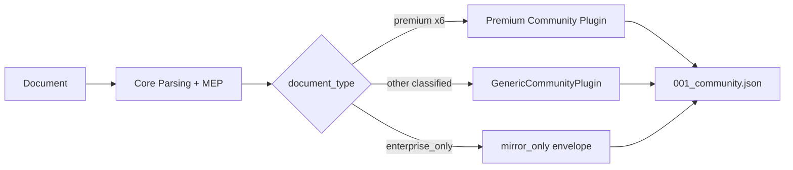

# Plugin System

DocMirror uses a plugin architecture to separate generic document parsing from domain-specific business logic.

## Community 6+1 Strategy

| Tier | Count | Modules | Output |
|------|-------|---------|--------|
| **Premium** | 6 | `{domain}/community_plugin.py` (bank/wechat/alipay/vat/business_license/credit_report) | Full structured extract |
| **Generic** | 1 | `generic/community_plugin.py` | Mirror → fields/records fallback |
| **Enterprise** | 120 | `docmirror_enterprise.plugins.*` | Deep extract (license required) |

Classification still covers **120+ document types**. Community structured output is **6 premium + 1 generic** only.

## Built-in Community Plugins

| Domain | Plugin | Description |
|--------|--------|-------------|
| `bank_statement` | `BankStatementCommunityPlugin` | Bank statements via BaseTableParser + column registry |
| `wechat_payment` | `WeChatPaymentCommunityPlugin` | WeChat payment ledger (v2.0 table schema) |
| `alipay_payment` | `AlipayPaymentCommunityPlugin` | Alipay payment ledger |
| `vat_invoice` | `VATInvoicePlugin` | VAT invoice KV + extract_from_mirror |
| `business_license` | `BusinessLicensePlugin` | Business license KV + extract_from_mirror |
| `credit_report` | `CreditReportPlugin` | Credit report KV + extract_from_mirror |
| `generic` | `GenericCommunityPlugin` | Fallback for all other classified types |

## How Plugins Work



Each premium plugin provides:

1. **Scene keywords** — trigger automatic domain classification (via shared YAML)
2. **Identity fields** — domain-specific entity definitions
3. **extract_from_mirror()** — v2.0 community JSON from frozen Mirror

The generic plugin maps Mirror key-values and logical tables into a standard community envelope with `plugin.name=generic`.

## Identity Resolution

When a plugin matches a detected scene, the `resolve_identity()` function uses the plugin's identity field definitions to map extracted entities into standardized properties:

```json
{
  "identity": {
    "document_type": "bank_statement",
    "properties": {
      "institution": "Example National Bank",
      "account_holder": "Acme Technology Co., Ltd.",
      "account_number": "6200000000001234567",
      "query_period": "2025/01/01 - 2025/12/31",
      "currency": "CNY"
    }
  }
}
```

See also: [community-vs-enterprise-edition.md](../design/community-vs-enterprise-edition.md), [14_community_focus_six_plus_generic_checklist.md](../design/14_community_focus_six_plus_generic_checklist.md), and [plugin_development_guide.md](../design/plugin_development_guide.md).

## Package Layout (`docmirror/plugins/`)

| Path | Role |
|------|------|
| `community.py` | Community capability yaml + plugin discovery (SSOT) |
| `plugin_registry.py` | `DomainPlugin` ABC + registry singleton |
| `runner.py` | PEC extract runner |
| `manager.py` / `state.py` | CLI enable/disable + `.plugin_state.json` |
| `licensing/` | Online/offline license + entitlements |
| `{domain}/community_plugin.py` | Per-domain community logic |
| `_base/` | Shared parsers and adapters |
